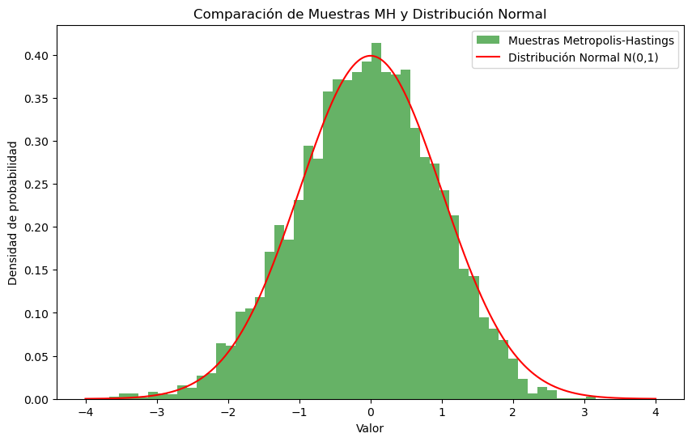

## Laboratorio 10 - Modelación y Simulación
**Integrantes**
- Gustavo Andrés González 21438
- Diego Alberto Leiva 21752
- José Pablo Orellana 21970
- - -
**Ejercicio 1** [Laboratorio 10](https://docs.google.com/document/d/1hfEtuICotdr_C3oo68Yw6SyYYjE55hOFHy8HEjYvD58/edit?usp=sharing)
- - -
**Ejercicio 2 - Metropolis-Hastings**

- - -
